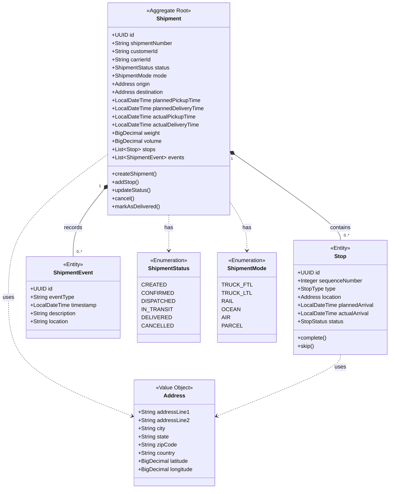
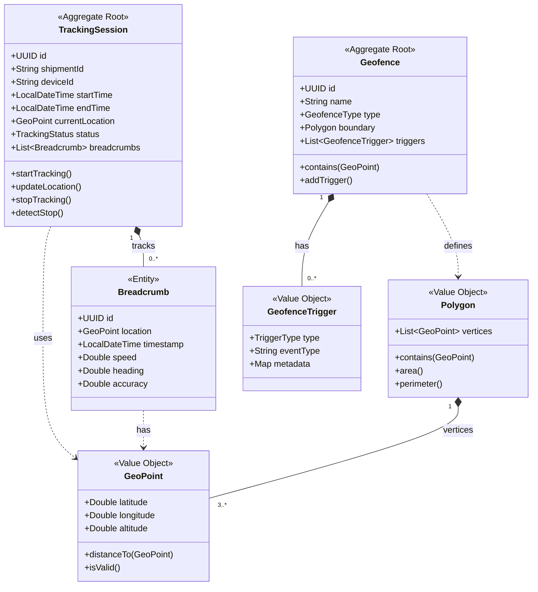
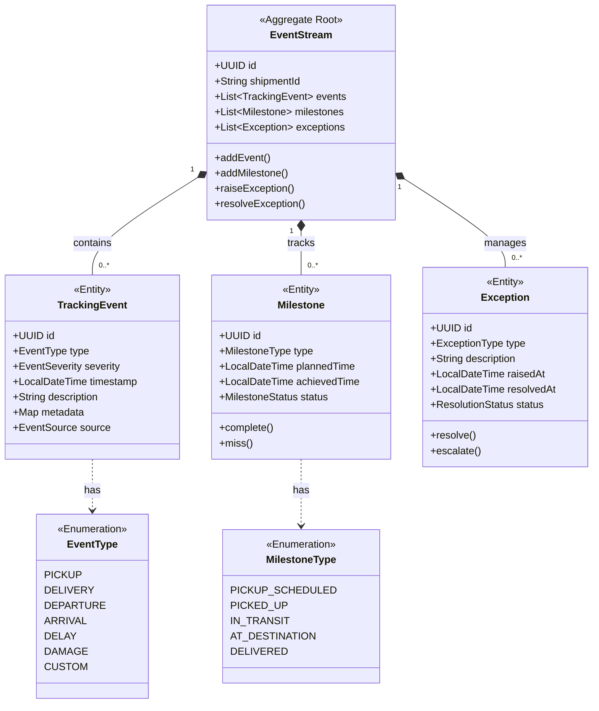
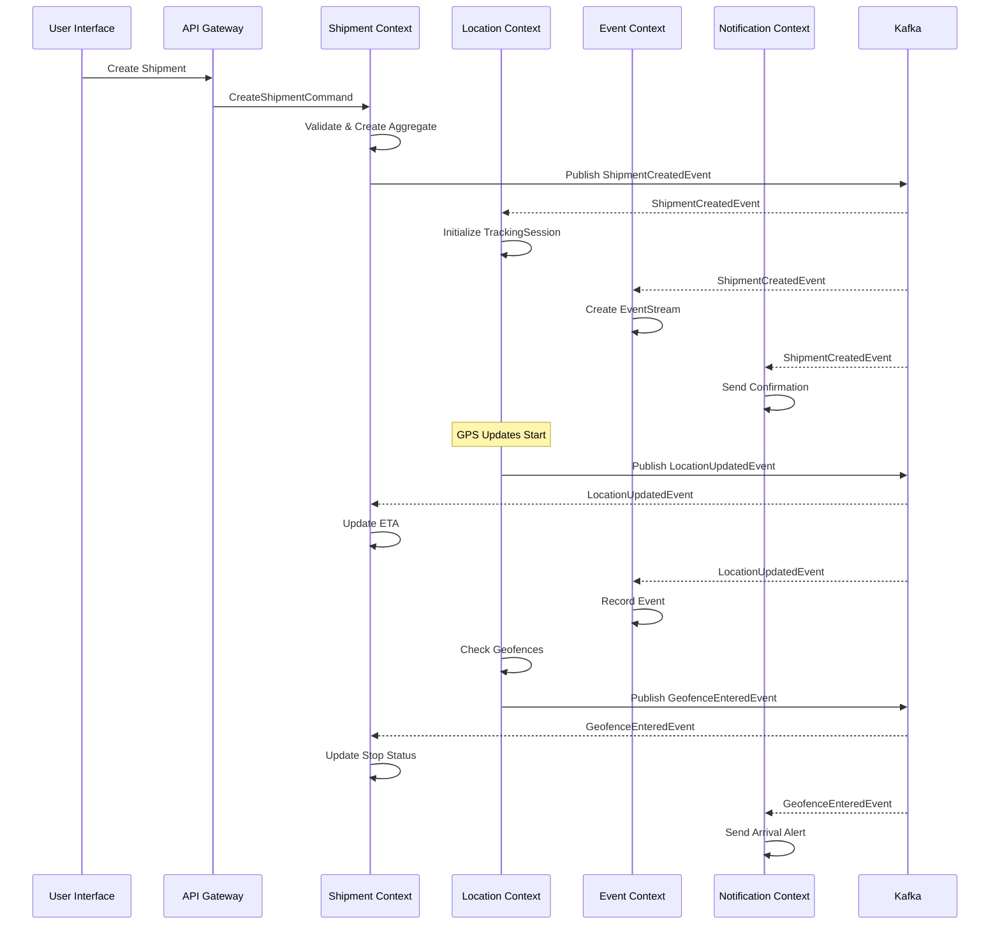
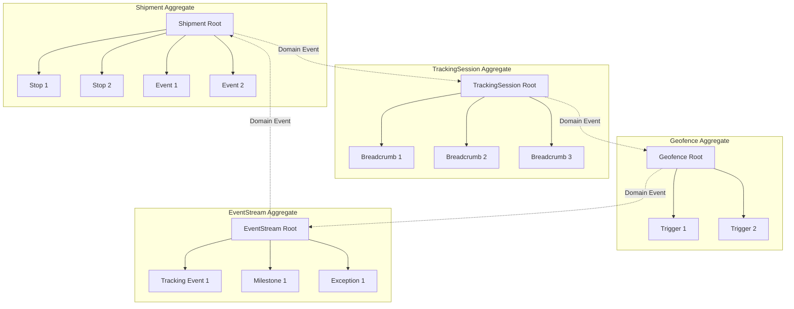
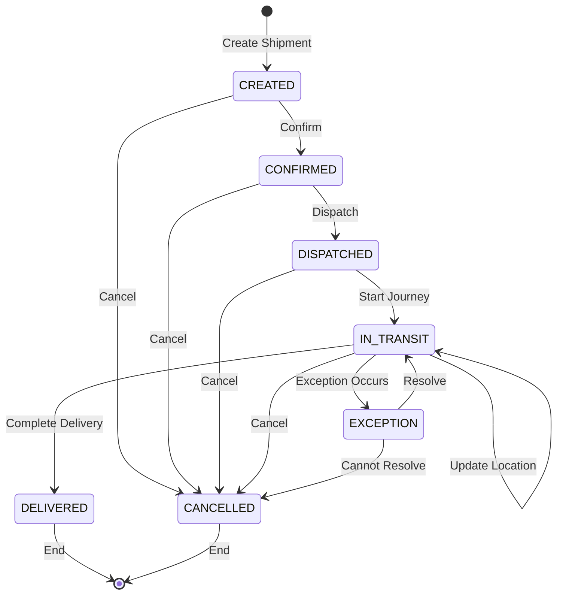
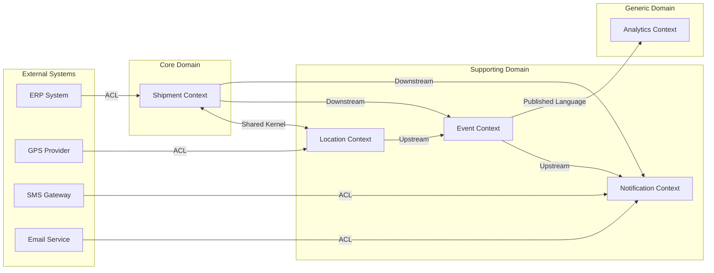
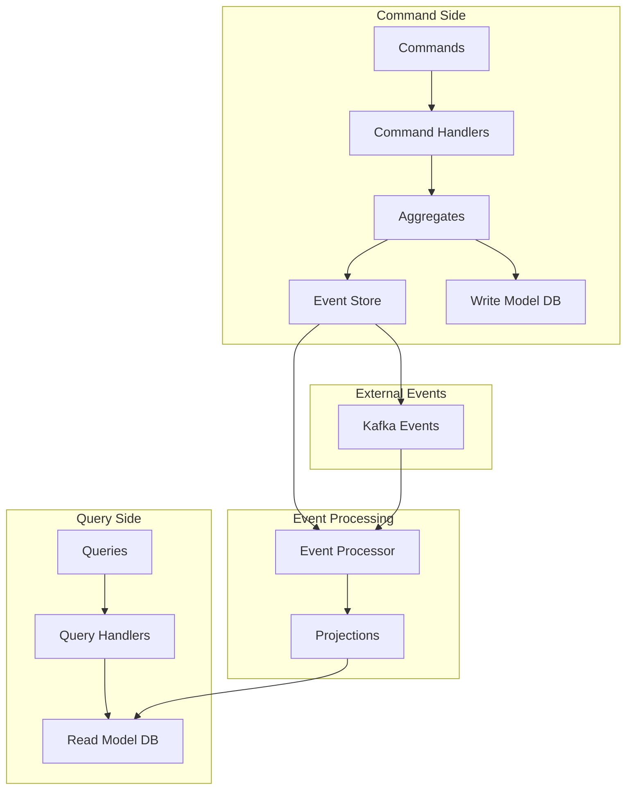
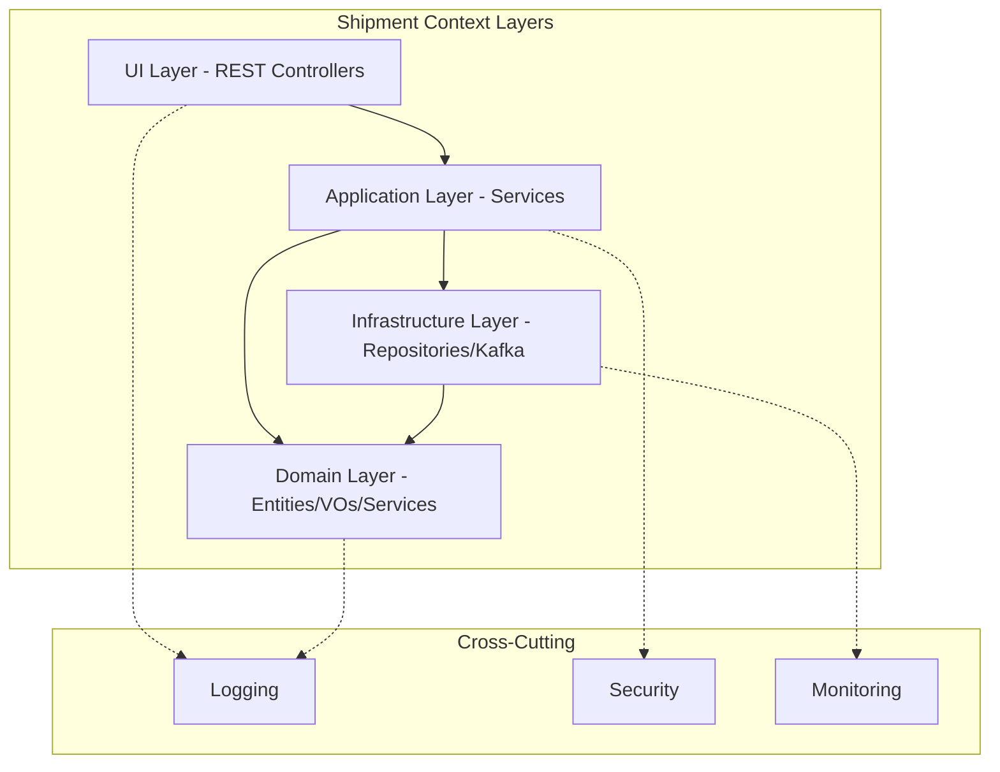

# Domain Model Visual Diagrams

## 1. Core Domain Model - Shipment Context



## 2. Location Context Domain Model



## 3. Event Context Domain Model



## 4. Domain Event Flow Diagram



## 5. Aggregate Boundaries and Transactions



## 6. State Machine - Shipment Status



## 7. Context Mapping



## 8. Command and Query Separation (CQRS)



## 9. Layered Architecture per Bounded Context



## 10. Event Storming Result

```
Legend:
🟧 = Domain Event
🟦 = Command
🟨 = Aggregate
🟪 = Policy
🟩 = Read Model
🟥 = External System
👤 = Actor

Timeline →

👤 Customer
    🟦 Request Shipment
        🟨 Shipment
            🟧 Shipment Requested
                🟪 Validate Business Rules
                    🟧 Shipment Created
                        🟩 Shipment List Updated

👤 Dispatcher
    🟦 Assign Carrier
        🟨 Shipment
            🟧 Carrier Assigned
                🟪 Notify Carrier
                    🟥 Send to TMS

👤 Driver
    🟦 Start Tracking
        🟨 TrackingSession
            🟧 Tracking Started
                🟪 Initialize GPS
                    🟥 GPS Provider

👤 System
    🟦 Update Location
        🟨 TrackingSession
            🟧 Location Updated
                🟪 Check Geofences
                    🟧 Geofence Entered
                        🟪 Update Stop Status
                            🟨 Shipment
                                🟧 Stop Arrived
                                    🟩 Real-time Dashboard

👤 Receiver
    🟦 Confirm Delivery
        🟨 Shipment
            🟧 Delivery Confirmed
                🟪 Calculate Metrics
                    🟨 Analytics
                        🟧 Metrics Updated
                            🟩 Performance Report
```

---

These diagrams provide a comprehensive visual representation of the Domain-Driven Design, showing:
- Class relationships and hierarchies
- Aggregate boundaries
- Event flows between contexts
- State transitions
- System architecture layers
- CQRS implementation
- Context mapping relationships

The visual models complement the textual DDD documentation and provide quick reference for developers implementing the system.